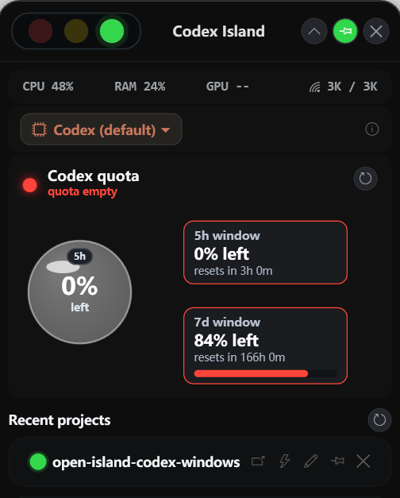
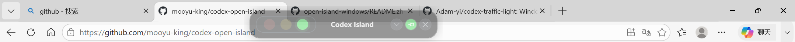

<div align="center">

# 🏝 Codex Open Island

**专为 Windows 平台 Codex 用户打造的桌面灵动岛工具**

[](LICENSE)
[](https://dotnet.microsoft.com/download/dotnet/8.0)
[]()

[English](README.md) · 简体中文

<br/>

</div>

## 🙏 灵感来源

本项目从以下三个优秀的开源项目中汲取了大量灵感和设计，特此感谢：

- 🟢 **[codex-led-widget](https://github.com/xicunwus2025-sys/codex-led-widget/)** — Codex 额度读取的 JSON-RPC stdio 协议、液态玻璃额度球视觉、红/黄/绿额度颜色映射
- 🟡 **[Agent-Signal-Bar-Windows](https://github.com/ridyang/Agent-Signal-Bar-Windows/)** — AI Agent 红绿灯信号分类体系、信号聚合优先级、Windows 托盘集成思路
- 🟣 **[open-island-windows](https://github.com/ludiwangfpga/open-island-windows/)** — WPF 透明悬浮窗动态灵动岛框架、展开/折叠交互模式、系统状态监控、Windows 打包实践

---

**Codex Open Island** 是一个专为 **Windows 平台 Codex 用户**设计的桌面悬浮组件，常驻系统托盘。它把 Codex 项目的运行状态、剩余额度、会话列表都汇聚到屏幕顶部一个精致的"灵动岛"上，让你无需频繁切换窗口就能掌握 Codex 的一切动态。



- 🔴🟡🟢 **红绿灯状态栏** —— 顶部信号灯实时反映 Codex 项目状态：工作中（绿灯慢闪）、思考中（绿灯快闪）、需审批（红灯快闪）、已完成（绿灯常亮 + 灵动岛持续弹跳）。一目了然，不用切窗口

- 🌐 **液态玻璃额度球** —— 玻璃质感的圆形水量指示器，绿 / 黄 / 红三色显示 Codex 剩余额度百分比，同时显示 5 小时窗口和 7 天窗口的详细信息

- 💻 **系统状态栏** —— 实时 CPU / 内存 / GPU / 网速监控

- 🔀 **模型切换** —— 支持 Codex 默认模型与 DeepSeek V4 一键切换，额度球自动适配显示（第三方模型显示"custom provider"）

- 📂 **项目列表** —— 从本地 Codex session 日志自动发现最近项目，点击卡片即可在 Codex 桌面应用中打开对应会话

- 🎯 **完成 / 审批弹跳** —— Codex 任务完成或需要用户审批时，灵动岛弹出到前台并持续跳动，点击岛体即停止

- 🔆 **智能淡入淡出** —— 鼠标离开 12 秒后自动半透明，不遮挡工作区

  

不打扰你 —— 折叠态停在屏顶，打游戏 / 写代码 / 看文档都不挡视野。**仅支持 Windows 10/11 x64。**

---

## 🗺 功能总览

| 板块 | 能力 |
|---|---|
| **🔴🟡🟢 红绿灯状态** | 10 种 Codex 项目状态映射 · 红/黄/绿三灯 · 快闪/慢闪/常亮 · 持续弹跳提醒 |
| **🌐 额度球** | 液态玻璃水球 · 绿(≥10%)/黄(<10%)/红(0%) · 5h + 7d 双窗口 · 自动刷新 |
| **💻 系统监控** | CPU / RAM / GPU / 网速 实时刷新 |
| **🔀 模型切换** | Codex / DeepSeek V4 下拉切换 · 选择持久化 · 额度球联动 |
| **📂 项目列表** | SQLite + JSONL 自动发现 · 点击跳转 Codex 桌面应用 · 恢复历史会话 |
| **🏝 灵动岛交互** | 展开/折叠 · 拖拽移动 · 双击折叠 · 悬停恢复 · 自动淡出 |
| **📌 系统托盘** | 显示/隐藏 · 始终置顶 · 退出 |

## 🎨 界面结构

```
┌─────────────────────────────────────────┐
│ [🔴][🟡][🟢]    Codex Island    [⌄][📌][✕] │  ← 红绿灯 + 标题 + 控制按钮
├─────────────────────────────────────────┤
│  CPU 12%   RAM 45%   GPU 32%   ↑↓ 网速  │  ← 系统监控栏
├─────────────────────────────────────────┤
│  [芯片] Codex (default)            [⚙]  │  ← 模型选择栏
├─────────────────────────────────────────┤
│          ╭──────────╮                   │
│          │  🌐 84%  │   5h: 84% left    │  ← 额度球 + 详情
│          │   left   │   7d: 92% left    │
│          ╰──────────╯                   │
├─────────────────────────────────────────┤
│  🟢 Codex project       working    [📂] │  ← 项目卡片列表
│  🟢 00-AI                done      [📂] │
└─────────────────────────────────────────┘
```

## 🚥 红绿灯状态说明

| 信号 | 灯色 | 闪烁 | 弹跳 | 触发事件 |
|------|:--:|------|:--:|------|
| **Ready** 就绪 | 🟢 绿 | Steady 常亮 | ❌ | 首次打开 / `sessionstart` / `idle` |
| **Thinking** 思考中 | 🟢 绿 | ⚡ Fast 快闪 | ❌ | `reasoning` / `task_started` |
| **Working** 工作中 | 🟡 黄 | 🐢 Slow 慢闪 | ❌ | `function_call` / `pre_tool_use` |
| **ToolDone** 步骤完成 | 🟢 绿 | 🐢 Slow 慢闪 | ❌ | `function_call_output` / `post_tool_use` |
| **Permission** 需审批 | 🟡 黄 | ⚡ Fast 快闪 | ✅ 持续跳动 | `approval_requested` / `permission_request` |
| **Attention** 需关注 | 🟡 黄 | 🐢 Slow 慢闪 | ❌ | `notification` / `needs_review` |
| **Blocked** 阻塞/错误 | 🔴 红 | ⚡ Fast 快闪 | ❌ | `failure` / `error` / `turn_aborted` |
| **Completed** 已完成 | 🟢 绿 | ⚡ Fast 快闪 | ✅ 持续跳动 | `task_complete` / `final_answer` |
| **Stale** 状态过期 | 🟡 黄 | 🐢 Slow 慢闪 | ❌ | 数据超过 10 分钟未更新 |
| **Paused** 已暂停 | ⚫ 灭 | — | ❌ | `pause` / `paused` |

> 💡 **弹跳行为**：首次打开不跳。Permission 或 Completed 进入时，灵动岛弹出到前台并持续跳动。**点击岛体、鼠标悬停、或重新打开 island** 即停止跳动。

## 🌐 额度球颜色规则

| 状态 | 颜色 | 条件 | 文案 |
|------|:--:|------|------|
| **Loading** 加载中 | ⚫ 灰 | 初始加载 | `Reading Codex quota` |
| **Healthy** 健康 | 🟢 `#32D74B` | 剩余 ≥ 10% | `quota healthy` |
| **Low** 偏低 | 🟡 `#FFD60A` | 1% ≤ 剩余 ≤ 9% | `quota below 10%` |
| **Empty** 耗尽 | 🔴 `#FF453A` | 剩余 = 0% | `quota empty` |
| **Stale** 过期 | ⚫ 灰 | 数据超出新鲜窗口 | `quota stale` |
| **Error** 错误 | 🔴 红 | 读取失败（超时 / 未登录） | `quota unavailable` |
| **Unknown** 未知 | ⚫ 灰 | 第三方模型（如 DeepSeek） | 显示模型名称 |

---

## 📦 安装

> **自包含** —— 已打包 .NET 8 运行时，无需额外安装任何依赖，Windows 10/11 x64 双击即用。

从 [Releases](../../releases) 下载：

- 📦 `CodexOpenIsland-vX.Y.Z-win-x64.zip` —— 解压得到 `CodexOpenIsland.exe`，双击运行

> ⚠️ 未做代码签名，Windows SmartScreen 会拦截。点 **更多信息 → 仍要运行** 即可。

## 🏃 快速开始

1. 下载 `CodexOpenIsland-vX.Y.Z-win-x64.zip`，解压
2. 双击 `CodexOpenIsland.exe`
3. 屏顶出现 Codex Island 灵动岛，系统托盘出现图标
4. 在终端运行 Codex：`codex`
5. 灵动岛自动检测项目状态并显示

托盘右键菜单：**Show Codex Island** / **Hide** / **Always on top** / **Exit**

## 🛠 从源码构建

要求 Windows + .NET 8 SDK。

```powershell
git clone https://github.com/mooyu-king/codex-open-island.git
cd codex-open-island
dotnet build CodexIsland.sln -c Release
```

发布自包含 exe（无需 .NET 运行时）：

```powershell
dotnet publish src/CodexIsland.App/CodexIsland.App.csproj `
  -c Release `
  -r win-x64 `
  --self-contained true `
  -p:PublishSingleFile=true `
  -p:IncludeNativeLibrariesForSelfExtract=true `
  -o artifacts/publish
```

产物：`artifacts/publish/CodexIsland.App.exe`（约 155MB，可直接分发）

## 🏗 架构

```
┌─────────────────────────────────────────────────┐
│                 CodexIsland.App                  │
│  MainWindow.xaml  ·  Controls  ·  ViewModels    │
│  (WPF MVVM · SignalLightBar · QuotaSphere)      │
├─────────────────────────────────────────────────┤
│                CodexIsland.Core                  │
│  Models  ·  Quota  ·  Signals  ·  Storage       │
│  (QuotaHealthMapper · ProjectSignalMapper)      │
├─────────────────────────────────────────────────┤
│               CodexIsland.Hooks                 │
│  (Codex hook → status.json 写入)                │
└─────────────────────────────────────────────────┘
```

| 项目 | 职责 |
|---|---|
| **CodexIsland.App** | WPF 界面：灵动岛主窗口、红绿灯控件、额度球控件、系统监控、MVVM |
| **CodexIsland.Core** | 业务逻辑：Codex 额度读取（JSON-RPC stdio）、项目信号映射、session 日志解析、SQLite 查询 |
| **CodexIsland.Hooks** | CLI 钩子：作为 Codex hook 子进程运行，将事件写入 `%LOCALAPPDATA%\CodexIsland\status.json` |

数据流：

```
Codex CLI (stdio JSON-RPC)
   │ account/rateLimits/read
   ▼
CodexQuotaService ──► QuotaHealthMapper ──► QuotaSphere UI

~/.codex/sessions/*.jsonl + state_*.sqlite
   │ Python SQLite query + JSONL 解析
   ▼
LocalProjectSignalService ──► ProjectSignalMapper ──► SignalLightBar UI
```

## 📄 License

[MIT](LICENSE) © 2025 mooyu-king
